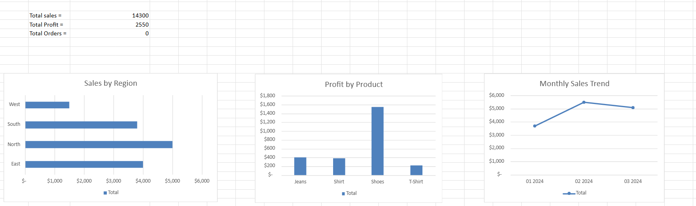

# 📊 Sales Dashboard Project (Excel)

This project showcases an interactive Excel dashboard built using a sample sales dataset. The goal is to visualize key business metrics like sales, profit, and product performance across different regions and time periods.

## 🗂 Dataset
- 6 sample orders from 4 regions
- Columns: Order ID, Date, Region, Product, Category, Sales, Profit

## ✅ Features
- Summary cards: Total Sales, Profit, and Orders
- Pivot Tables for region-wise and product-wise analysis
- Line Chart for Monthly Sales Trend
- Bar Charts for Top Regions and Products
- Slicers for interactive filtering (Region, Product)

## 🧰 Tools Used
- Microsoft Excel
- Pivot Tables
- Pivot Charts
- Slicers
- Conditional Formatting

## 📷 Dashboard Preview

---

🎯 Goal: Demonstrate dashboarding and analytical storytelling in Excel
